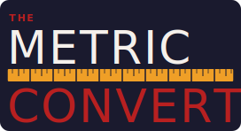

# The Metric Convert



> A clean, interactive learning app to master the metric system through hands-on conversions with step-by-step explanations.

---

## Table of Contents

- [Features](#features)
- [Project Structure](#project-structure)
- [Prerequisites](#prerequisites)
- [Getting Started](#getting-started)
  - [Backend Setup](#backend-setup)
  - [Frontend Setup](#frontend-setup)
- [Running Locally](#running-locally)
- [Architecture](#architecture)
- [API Reference](#api-reference)
- [Frontend Guide](#frontend-guide)
- [Development](#development)
- [Future Enhancements](#future-enhancements)
- [License](#license)

---

## Features

✨ **Interactive Converter**
- Real-time metric conversions with step-by-step math explanations
- Dropdown unit selector with 20+ metric and imperial units
- Learning tips tailored to each conversion

🌓 **Dark & Light Modes**
- Automatic theme detection based on system preference
- Manual toggle in navbar with localStorage persistence
- Full visual compatibility for all components

📚 **Learning Center**
- Lessons on base metric units (meter, gram, liter)
- Common metric prefixes and their magnitudes
- Imperial vs. metric comparison guide

📊 **Unit Library**
- Comprehensive catalog with unit categories
- Metadata for metric prefix relationships
- JSON representation for extensibility

---

## Project Structure

```
TheMetricConvert/
├── backend/
│   └── TheMetricConvert.Api/        # ASP.NET Core 10 Web API
│       ├── Program.cs               # App configuration
│       ├── Models.cs                # Request/response DTOs
│       ├── UnitCatalog.cs           # Unit definitions
│       ├── UnitConverter.cs         # Conversion logic
│       └── TheMetricConvert.Api.http  # HTTP test file
├── frontend/
│   ├── src/
│   │   ├── app/
│   │   │   ├── app.ts               # Root component, theme logic
│   │   │   ├── app.html             # Shell + navbar
│   │   │   ├── converter.component.* # Main converter UI
│   │   │   ├── learn.component.*    # Learning content
│   │   │   ├── api.service.ts       # HTTP wrapper
│   │   │   └── app.routes.ts        # Routing config
│   │   ├── assets/                  # Logos & branding
│   │   ├── styles.scss              # Global styles
│   │   └── index.html               # Entry point
│   ├── angular.json                 # Angular build config
│   └── package.json                 # Dependencies
├── README.md
└── TheMetricConvert.sln             # Solution file

```

---

## Prerequisites

- **Node.js** 18+ (for Angular & npm)
- **.NET 10 SDK** ([download](https://dotnet.microsoft.com/download/dotnet/10.0))
  - Verify: `dotnet --list-sdks`
- **Git** (for version control)

---

## Getting Started

### Backend Setup

1. **Navigate to backend directory:**
   ```bash
   cd backend/TheMetricConvert.Api
   ```

2. **Restore dependencies:**
   ```bash
   dotnet restore
   ```

3. **Build the project:**
   ```bash
   dotnet build
   ```

### Frontend Setup

1. **Navigate to frontend directory:**
   ```bash
   cd frontend
   ```

2. **Install npm dependencies:**
   ```bash
   npm install
   ```

---

## Running Locally

### Start the Backend (Terminal 1)

```bash
cd backend/TheMetricConvert.Api
dotnet run --urls http://localhost:5080
```

The backend will:
- Listen on `http://localhost:5080`
- Swagger UI available at `http://localhost:5080/swagger`
- Health check at `http://localhost:5080/healthz`

### Start the Frontend (Terminal 2)

```bash
cd frontend
npm start
```

The frontend will:
- Open automatically at `http://localhost:4200`
- Hot-reload on file changes
- Proxy API calls to `http://localhost:5080`

### Test a Conversion

1. Open `http://localhost:4200` in your browser
2. Enter a value (e.g., `100`)
3. Select "From" unit (e.g., `cm` – centimeters)
4. Select "To" unit (e.g., `m` – meters)
5. Click **Convert** → see result + step-by-step breakdown

---

## Architecture

### Backend (ASP.NET Core 10)

**Key Components:**

- **Program.cs**
  - Configures services, middleware, CORS
  - Enables Swagger with custom formatting

- **Models.cs**
  - `UnitDefinition`: metadata (name, symbol, category, system)
  - `ConversionRequest`: `{ from, to, value }`
  - `ConversionResult`: `{ outputValue, outputUnit, steps[], tip }`

- **UnitCatalog.cs**
  - Static catalog of 20+ units across 4 categories
  - Lookup by symbol

- **UnitConverter.cs**
  - Core logic for conversions
  - Generates step-by-step explanations
  - Provides learning tips (especially for metric prefixes)

### Frontend (Angular 21 + Standalone Components)

**Key Components:**

- **App Shell** (`app.ts`, `app.html`)
  - Root component with theme state management
  - Light/dark mode toggle with localStorage
  - Dynamic navbar logo switching
  - Navigation routing

- **ConverterComponent** (route `/`)
  - Form for value + unit selection
  - Calls `ApiService.convert()`
  - Renders results and step list

- **LearnComponent** (route `/learn`)
  - Static lessons on metric fundamentals
  - Placeholder structure for future interactive lessons

- **ApiService**
  - Wraps HTTP calls to backend
  - Methods: `getUnits()`, `convert(body)`
  - Handles errors gracefully

---

## API Reference

### Endpoints

#### GET `/healthz`

Health check (liveness probe).

**Response:** `200 OK`

---

#### GET `/api/units`

Returns the complete unit catalog.

**Response:** `200 OK`
```json
[
  {
    "symbol": "cm",
    "name": "Centimeter",
    "category": "Length",
    "system": "Metric",
    "prefix": "centi",
    "prefixExponent": -2
  },
  ...
]
```

---

#### POST `/api/conversions`

Converts a value from one unit to another.

**Request Body:**
```json
{
  "from": "cm",
  "to": "m",
  "value": 100
}
```

**Response:** `200 OK`
```json
{
  "outputValue": 1,
  "outputUnit": "m",
  "steps": [
    "100 cm = 100 × (1/100) m",
    "100 ÷ 100 = 1 m"
  ],
  "tip": "Centi- means 1/100, so dividing by 100 converts centimeters to meters."
}
```

---

## Frontend Guide

### Theming

The app supports light and dark modes:

- **Default**: System preference (via `prefers-color-scheme`)
- **Manual Toggle**: Sun (☀️) / Moon (🌙) button in navbar
- **Persistence**: Theme setting saved in `localStorage` as `app-theme`
- **Dynamic Logo**: Navbar and homepage logos switch based on theme

**CSS Variable Pattern:**
```scss
[data-theme="dark"] {
  --bg: #1a1a2e;
  --text: #f5f5f5;
  /* ... */
}

[data-theme="light"] {
  --bg: #f9fafb;
  --text: #111827;
  /* ... */
}
```

### Navigation

- **Converter** (`/`) – Main conversion interface
- **Lessons** (`/lessons`) – Learning materials (in development)
- **Units** (`/units`) – Browse unit catalog (in development)
- **Profile** (`/profile`) – User profile/history (in development)

### Form Submission

The converter form uses Angular's `FormsModule` with two-way binding (`[(ngModel)]`):

```html
<input [(ngModel)]="value()" (ngModelChange)="value.set($event)" />
```

This ensures the signal updates whenever the user types.

---

## Development

### File Watching & Hot Reload

**Backend:**
```bash
cd backend/TheMetricConvert.Api
dotnet watch run --urls http://localhost:5080
```

**Frontend:**
```bash
cd frontend
npm start  # Angular CLI dev server with live reload
```

### HTTP Testing (Backend)

The project includes `backend/TheMetricConvert.Api/TheMetricConvert.Api.http` for testing API endpoints in VS Code using the REST Client extension.

Example:
```http
POST http://localhost:5080/api/conversions
Content-Type: application/json

{
  "from": "cm",
  "to": "m",
  "value": 50
}
```

### Code Guidelines

- **Backend**: Intent-focused XML doc comments for Swagger clarity
- **Frontend**: Inline comments for strategic TODOs; no over-commenting
- **Naming**: Clear, descriptive names; avoid abbreviations except for established terms (e.g., "cm", "API")

---

## Future Enhancements

- 🔐 User authentication & history tracking (profile page)
- 📊 Unit library browser with detailed metadata (/units)
- 🎓 Interactive lessons & quizzes (/lessons)
- 🌍 Internationalization (i18n) for multiple languages
- 📱 Mobile app (React Native or Flutter)
- 🧪 Additional unit categories (temperature conversions, time, etc.)
- 💾 Save favorite conversions
- 🔄 Bidirectional conversion preview

---

## License

This project is open source. Check the project repository for licensing details.

---

## Contributing

Contributions are welcome! Please:

1. Fork the repository
2. Create a feature branch (`git checkout -b feature/your-feature`)
3. Commit your changes with clear messages
4. Push and open a pull request

---

## Support

For questions or issues:
- Open a GitHub issue
- Check existing documentation in `/docs` (if available)

---

**Happy converting! 🎯**

